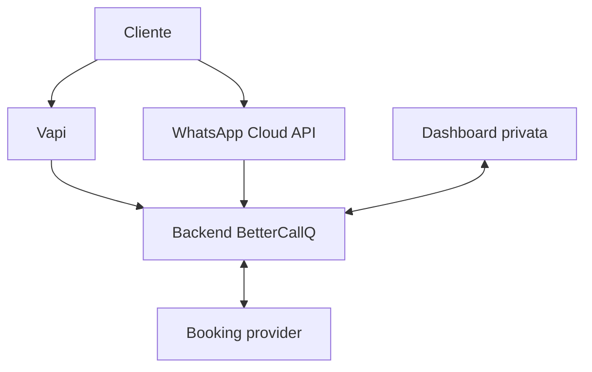

# BetterCallQ Dashboard — Architettura

**Stato:** architettura logica iniziale  
**Ultimo aggiornamento:** 30 luglio 2026

## 1. Obiettivo architetturale

Costruire una dashboard privata, affidabile e progressivamente integrabile senza
accoppiare l'interfaccia direttamente a Vapi, WhatsApp o Treatwell.

La prima milestone è un prototipo frontend completo con dati dimostrativi. Le
fixture vengono poi sostituite, una fonte alla volta, mantenendo invariati i
contratti usati dalle pagine.

## 2. Contesto del sistema



Il booking provider desiderato è Treatwell, ma le sue operazioni disponibili
devono essere confermate. Il codice deve quindi dipendere da un contratto
astratto e non da chiamate Treatwell distribuite nell'applicazione.

## 3. Repository e confini di distribuzione

### 3.1 Repository dashboard

`bettercallq_dashboard` conterrà:

- applicazione Next.js;
- pagine e componenti;
- contratti TypeScript e schemi Zod;
- service layer;
- API proprie della dashboard, quando introdotte;
- migrazioni e accesso al database, quando introdotti;
- test;
- documentazione.

### 3.2 Server webhook esistente

Il server Render già usato per Vapi rimane nel repository attuale durante il
prototipo. Non va duplicato o riscritto nella Task 1.

Nella fase di integrazione Vapi si deciderà se:

1. mantenerlo come servizio separato che scrive nel database condiviso; oppure
2. spostare gradualmente gli endpoint nel backend BetterCallQ.

La decisione deve considerare downtime, semplicità di deploy e compatibilità con
il flusso già funzionante.

## 4. Stack previsto

### 4.1 Frontend

- Next.js con App Router;
- TypeScript in modalità strict;
- Tailwind CSS;
- shadcn/ui e primitive Radix;
- Lucide per le icone;
- Recharts per i grafici;
- Framer Motion soltanto per transizioni utili;
- Zod per validazione e contratti runtime.

### 4.2 Backend e persistenza

La scelta definitiva viene effettuata nella fase dedicata. L'architettura assume:

- API autenticate;
- database relazionale, preferibilmente PostgreSQL;
- migrazioni versionate;
- supporto a transazioni e vincoli univoci;
- possibilità di aggiornamenti realtime o invalidazione della cache.

Nessuna scelta di provider cloud è vincolante in questa fase.

## 5. Strati applicativi

```text
Pagine e route
      ↓
Componenti di dominio
      ↓
Service layer
      ↓
Repository / API client
      ↓
Database e adapter esterni
```

### 5.1 Pagine e route

Compongono l'esperienza utente e gestiscono navigazione, parametri e autorizzazione
della route. Non contengono chiamate dirette ai provider esterni.

### 5.2 Componenti di dominio

Esempi:

- `KpiCard`;
- `ChannelStatusCard`;
- `InterventionQueue`;
- `RecentCalls`;
- `WhatsAppConversationList`;
- `IntegrationErrorCard`;
- `UsageChart`;
- `BookingOutcomeChart`.

Un eventuale `DashboardWidgetRenderer` accetta widget BetterCallQ tipizzati. Non
interpreta JSON arbitrario generato da un modello.

### 5.3 Service layer

Espone operazioni stabili alle pagine:

```ts
interface DashboardService {
  getReportingDate(salonId: string): Promise<string>;
  getOverview(salonId: string, range: DateRange): Promise<Overview>;
  listInterventions(
    salonId: string,
    filters: InterventionFilters,
  ): Promise<Intervention[]>;
  getIntervention(
    salonId: string,
    interventionId: string,
  ): Promise<InterventionDetail | null>;
  markInterventionInProgress(
    salonId: string,
    interventionId: string,
  ): Promise<Intervention>;
  resolveIntervention(
    salonId: string,
    interventionId: string,
    input: ResolveInterventionInput,
  ): Promise<Intervention>;
  reopenIntervention(
    salonId: string,
    interventionId: string,
  ): Promise<Intervention>;
  listCallHistory(
    salonId: string,
    query: CallHistoryQuery,
  ): Promise<CallHistoryPage>;
  getCall(salonId: string, callId: string): Promise<CallDetail | null>;
  listConversationInbox(
    salonId: string,
    filters: ConversationFilters,
  ): Promise<ConversationInbox>;
  getConversation(
    salonId: string,
    conversationId: string,
  ): Promise<ConversationDetail | null>;
  takeConversationControl(
    salonId: string,
    conversationId: string,
  ): Promise<Conversation>;
  sendManualMessage(
    salonId: string,
    conversationId: string,
    input: SendManualMessageInput,
  ): Promise<Message>;
  releaseConversationControl(
    salonId: string,
    conversationId: string,
  ): Promise<Conversation>;
  completeConversation(
    salonId: string,
    conversationId: string,
  ): Promise<Conversation>;
  getReceptionistSettings(salonId: string): Promise<ReceptionistSettings>;
  updateReceptionistSettings(
    salonId: string,
    input: UpdateReceptionistSettingsInput,
  ): Promise<ReceptionistSettings>;
}
```

Nel prototipo il service layer legge fixture. In produzione chiama API o
repository reali. I componenti non cambiano quando viene sostituita
l'implementazione.

Le mutazioni della Task 6A sono simulate e conservate soltanto nell'istanza
client del service mock. Coda, navigazione e widget della Panoramica condividono
lo stesso stato durante la sessione; il ricaricamento della pagina ripristina le
fixture originali. La persistenza viene introdotta nella Task 8.

La Task 6B espone lo storico chiamate come risultato paginato. Filtri, conteggi
per esito e riepilogo vengono calcolati dal service sull'intero insieme
filtrato, prima di applicare la pagina. Il dettaglio aggrega il riferimento
minimo all'appuntamento e lo stato corrente dell'eventuale intervento, mantenendo
deep link bidirezionali tra le due sezioni. Il prototipo non richiede né
riproduce registrazioni audio.

La Task 6C mantiene conversazioni, messaggi e controllo nell'istanza client del
service mock. La presa di controllo aggiorna in modo coerente conversazione ed
eventuale intervento; soltanto il controllo umano abilita l'invio manuale. Il
rilascio riattiva l'IA e il completamento chiude il thread, risolvendo
l'eventuale intervento attivo. Il dettaglio aggrega ultimo stato, messaggi,
appuntamento e richiesta collegata. Nessuna mutazione chiama Meta e il
ricaricamento ripristina le fixture.

La Task 7A mantiene una copia modificabile di `ReceptionistSettings`
nell'istanza client del service mock. L'input di aggiornamento contiene soltanto
i campi configurabili: identificativi, `salonId`, versione e timestamp restano
responsabilità del service. Ogni salvataggio valido incrementa `version` e
`updatedAt`, ma conserva `publishedAt`: salvare in BetterCallQ non equivale a
pubblicare un nuovo prompt su Vapi. La UI applica la stessa validazione Zod del
service, segnala la sezione da correggere e protegge le modifiche non salvate.
Il ricaricamento ripristina la fixture originale fino alla persistenza della
Task 8.

La Task 7B legge numero del salone e stato dei canali attraverso il service
mock. Numero WhatsApp e messaggio precompilato restano nello stato locale
della pagina; il link `wa.me` viene validato e costruito deterministicamente.
PNG e SVG sono generati nel browser dalla stessa stringa, senza token Meta,
endpoint BetterCallQ o servizi QR esterni.

La Task 7C legge due intervalli equivalenti tramite `getOverview` e aggrega le
`DailyMetric` in helper puri e testati. Volumi, percentuali, durata, proiezione
mensile e variazioni non vengono calcolati nei componenti. La ripartizione dei
costi usa tariffe esclusivamente dimostrative centralizzate; il totale giornaliero
resta quello dichiarato nelle fixture e telefonia/piattaforma assorbono il
residuo. Le fixture coprono quattordici giorni per permettere il confronto tra
settimane senza introdurre dati esterni.

### 5.4 Repository

Contengono l'accesso ai dati persistenti e applicano sempre il filtro `salonId`.
Non restituiscono segreti o credenziali al frontend.

### 5.5 Adapter esterni

Ogni integrazione ha un confine dedicato:

- `VapiAdapter`;
- `WhatsAppAdapter`;
- `BookingProvider`;
- eventuale `GoogleCalendarAdapter` transitorio.

Errori esterni vengono convertiti in errori di dominio coerenti e, quando
necessario, in una `Intervention`.

## 6. Booking provider

Contratto iniziale:

```ts
interface BookingProvider {
  checkAvailability(
    salonId: string,
    request: AvailabilityRequest,
  ): Promise<AvailableSlot[]>;
  createBooking(
    salonId: string,
    request: CreateBookingRequest,
  ): Promise<BookingReference>;
  updateBooking(
    salonId: string,
    externalBookingId: string,
    changes: UpdateBookingRequest,
  ): Promise<BookingReference>;
  cancelBooking(
    salonId: string,
    externalBookingId: string,
    reason?: string,
  ): Promise<void>;
  getBooking(
    salonId: string,
    externalBookingId: string,
  ): Promise<BookingReference | null>;
}
```

Non tutte le implementazioni sono obbligate a supportare ogni operazione.
L'adapter deve esporre le proprie capacità, così l'assistente evita di promettere
azioni non disponibili.

```ts
interface BookingProviderCapabilities {
  readAvailability: boolean;
  createBooking: boolean;
  updateBooking: boolean;
  cancelBooking: boolean;
}
```

## 7. Fonti autorevoli dei dati

| Dato | Fonte autorevole prevista | Copia BetterCallQ |
|---|---|---|
| Agenda ordinaria e appuntamenti | Treatwell, se l'accesso è confermato | Solo riferimento e stato di sincronizzazione |
| Chiamate ed eventi vocali | Eventi Vapi elaborati dal backend | Sì |
| Conversazioni e messaggi WhatsApp | Eventi Meta elaborati dal backend | Sì, secondo retention |
| Impostazioni receptionist | BetterCallQ | Sì |
| Richieste di intervento | BetterCallQ | Sì |
| Metriche operative | BetterCallQ, derivate dagli eventi | Sì |
| Credenziali integrazioni | Secret store lato server | Mai nel browser o nei documenti |

Se Treatwell non offre le operazioni necessarie, occorre scegliere e documentare
un fallback. Google Calendar può essere valutato come ponte transitorio perché
è già presente nel progetto, ma non diventa automaticamente la fonte definitiva.

## 8. Flussi dati

### 8.1 Fine chiamata Vapi

1. Vapi invia l'evento al webhook.
2. Il server verifica il segreto o il meccanismo di autenticazione previsto.
3. Calcola una chiave idempotente dall'evento.
4. Registra o aggiorna `Call`.
5. Salva trascrizione e riepilogo secondo la policy di retention.
6. Collega l'eventuale `BookingReference`.
7. Se la richiesta è incompleta o fallisce, crea `Intervention`.
8. Aggiorna le metriche e notifica la dashboard.

### 8.2 Messaggio WhatsApp

1. Meta verifica l'endpoint e invia il webhook.
2. Il backend deduplica il messaggio.
3. Risolve salone, cliente e conversazione.
4. Salva il messaggio.
5. Decide se il controllo appartiene all'IA o all'operatore.
6. Elabora e invia la risposta, se consentito.
7. Registra esito ed eventuali errori.
8. Aggiorna l'inbox.

### 8.3 Modifica impostazioni

1. Il browser invia un payload validato.
2. Il backend autentica utente e autorizzazione sul `salonId`.
3. Valida nuovamente con lo schema server.
4. salva una nuova versione delle impostazioni;
5. registra l'audit;
6. invalida le cache necessarie;
7. rende la configurazione disponibile all'assistente.

## 9. API logiche previste

Gli endpoint definitivi possono cambiare, ma le responsabilità restano separate:

```text
GET    /api/overview
GET    /api/interventions
PATCH  /api/interventions/:id
GET    /api/calls
GET    /api/calls/:id
GET    /api/conversations
GET    /api/conversations/:id
POST   /api/conversations/:id/takeover
POST   /api/conversations/:id/release
POST   /api/conversations/:id/messages
GET    /api/settings
PUT    /api/settings
GET    /api/channels
GET    /api/metrics
POST   /api/webhooks/vapi
GET    /api/webhooks/whatsapp
POST   /api/webhooks/whatsapp
```

I webhook possono restare sul servizio Render separato. In quel caso gli ultimi
endpoint appartengono a quel servizio e non all'app Next.js.

## 10. Stati asincroni e realtime

Ogni pagina deve rappresentare:

- caricamento iniziale;
- aggiornamento in corso;
- dati assenti;
- errore recuperabile;
- integrazione offline;
- dato potenzialmente non aggiornato.

La prima versione può usare refresh manuale o polling moderato. Realtime viene
introdotto dopo la persistenza reale, evitando di legare i componenti a uno
specifico provider.

## 11. Sicurezza

### 11.1 Autenticazione e autorizzazione

- sessioni sicure e cookie `HttpOnly`, quando applicabile;
- controllo di autorizzazione lato server su ogni operazione;
- isolamento per `salonId`;
- protezione CSRF per le mutazioni compatibili;
- rate limiting su login, invio messaggi e webhook.

### 11.2 Segreti

- nessun secret nel repository;
- `.env` escluso da Git;
- `.env.example` contiene soltanto nomi e descrizioni;
- credenziali accessibili solo al backend;
- rotazione possibile senza modificare il codice.

### 11.3 Webhook

- verifica dell'autenticità;
- idempotenza;
- timestamp e protezione dai replay, se supportati;
- risposta rapida e lavorazione asincrona per operazioni lente;
- log tecnici senza contenuto sensibile non necessario.

## 12. Privacy e retention

Classificazione minima:

| Categoria | Esempi | Trattamento |
|---|---|---|
| Identificativi cliente | nome, telefono | Accesso ristretto e cifratura in transito |
| Contenuto comunicazioni | messaggi, trascrizioni | Retention breve e configurabile |
| Audio | registrazioni | Disattivato per default |
| Dati operativi | esito, durata, stato | Conservazione per metriche |
| Segreti | token e chiavi | Secret store, mai nel database applicativo in chiaro |

Le durate definitive di retention e le basi giuridiche devono essere definite
prima del pilota con dati reali.

## 13. Affidabilità e osservabilità

- identificatore univoco per ogni evento esterno;
- vincoli univoci per impedire duplicati;
- retry con backoff per errori temporanei;
- dead-letter o coda errori per eventi non processabili;
- `IntegrationError` visibile in forma comprensibile;
- correlazione tra chiamata, conversazione, prenotazione e intervento;
- metriche tecniche separate dalle metriche mostrate al parrucchiere.

## 14. Strategia di test

### Prototipo

- test degli schemi Zod;
- test dei service mock;
- test dei componenti critici;
- verifica responsive;
- lint e build.

### Integrazioni reali

- fixture di webhook firmati;
- test di idempotenza;
- test dei permessi per `salonId`;
- contract test per gli adapter;
- test end-to-end dei flussi principali;
- test di errore e retry.

## 15. Decisioni architetturali iniziali

| ID | Decisione | Motivazione |
|---|---|---|
| ADR-001 | Nuovo repository dedicato alla dashboard | Separare UI e sviluppo dal server Vapi già operativo |
| ADR-002 | Interfaccia fissa, non generativa | Prevedibilità e sicurezza operativa |
| ADR-003 | Service layer tra pagine e dati | Sostituire fixture e integrazioni senza riscrivere la UI |
| ADR-004 | Schemi specifici di dominio con Zod | Evitare strutture generiche `label/value` |
| ADR-005 | `salonId` su tutte le entità operative | Preparare isolamento e futura evoluzione multi-salone |
| ADR-006 | `BookingProvider` astratto | Treatwell non è ancora tecnicamente confermato |
| ADR-007 | Treatwell non viene duplicato | Evitare due agende divergenti |
| ADR-008 | Vapi come prima integrazione reale | È il canale già più avanzato nel progetto |

## 16. Questioni da decidere più avanti

- provider di autenticazione;
- ORM e provider PostgreSQL;
- permanenza o migrazione del server Render;
- meccanismo realtime;
- capacità reali Treatwell;
- fallback di prenotazione;
- retention definitiva;
- ruoli utente;
- hosting della dashboard.

## 15. Fondazione RBAC della Task 8A

Ruoli, permessi e navigazione sono definiti in moduli centrali e indipendenti
dal provider di autenticazione. La shell continua temporaneamente a usare
`admin` come ruolo dimostrativo, così il prototipo esistente non cambia
comportamento prima dell'introduzione delle sessioni.

La Task 8B risolverà il ruolo dalla sessione. La Task 8C applicherà controlli
server-side su route, service, repository e `salonId`. Il filtraggio della
navigazione non è un confine di sicurezza.

## 16. Autenticazione e sessione della Task 8B

Supabase Auth gestisce identità e credenziali. `@supabase/ssr` conserva access
token e refresh token in cookie disponibili a Server Component, Server Action e
Route Handler. `src/proxy.ts` rinnova la sessione e applica soltanto il redirect
ottimistico; le verifiche definitive restano nei confini server-side.

Il layout pubblico contiene login e callback. Il route group `(dashboard)`
risolve la sessione prima di caricare la shell e passa il ruolo ai componenti di
navigazione. Ruolo e `salonId` provengono temporaneamente da `app_metadata`,
che l'utente non può modificare dal client.

La Task 8C sostituirà il collegamento temporaneo con profili e membership
persistenti, repository reali e Row Level Security.

## 17. Migrazioni Supabase

Lo schema PostgreSQL è versionato in `supabase/migrations`. Le modifiche remote
non devono essere effettuate direttamente dal Table Editor una volta avviato
questo workflow.

La Task 8C.1 crea una fondazione chiusa: RLS attiva, nessuna policy per il
frontend e nessun repository reale. L'app continua a usare le fixture finché
membership, policy e query server-side non sono completate e testate.

## 18. Risoluzione dell'identità

La sessione SSR verifica prima Supabase Auth e poi invoca una RPC PostgreSQL
limitata all'utente corrente. La RPC legge profilo e membership con privilegi
`security definer`, ma non riceve parametri che possano selezionare un altro
utente.

Finché la migrazione non è disponibile sul remoto, la sessione mantiene un
fallback agli `app_metadata`. Una volta verificate le policy RLS della Task 8C.3,
il fallback verrà eliminato.

## 19. Superfici read-only

Le pagine cliente non interrogheranno direttamente le tabelle operative.
Useranno viste `security_invoker` che mantengono RLS e rimuovono colonne
sensibili.

La separazione è doppia:

1. RLS limita le righe al `salon_id` autorizzato;
2. i privilegi di colonna e le viste limitano i campi esposti.

Transcript, recording, payload e corpi dei messaggi richiedono repository
server-side separati.

## 20. Repository della dashboard cliente

Le pagine cliente dipendono da un unico snapshot mensile. Il repository sceglie
la sorgente tramite una variabile server-side e restituisce lo stesso contratto
sia per fixture sia per Supabase.

La modalità Supabase usa il client SSR autenticato e interroga soltanto viste
`security_invoker`. Ogni risultato viene validato con Zod e ricontrollato
rispetto al `salon_id` della sessione.

## 21. Confine di ingestione

Il server webhook valida i provider e invoca funzioni PostgreSQL riservate a
`service_role`. Il database esegue deduplicazione, upsert e aggiornamento dei
consumi nella stessa transazione.

La dashboard resta un consumer read-only. Non riceve direttamente webhook e non
possiede credenziali di ingestione.
