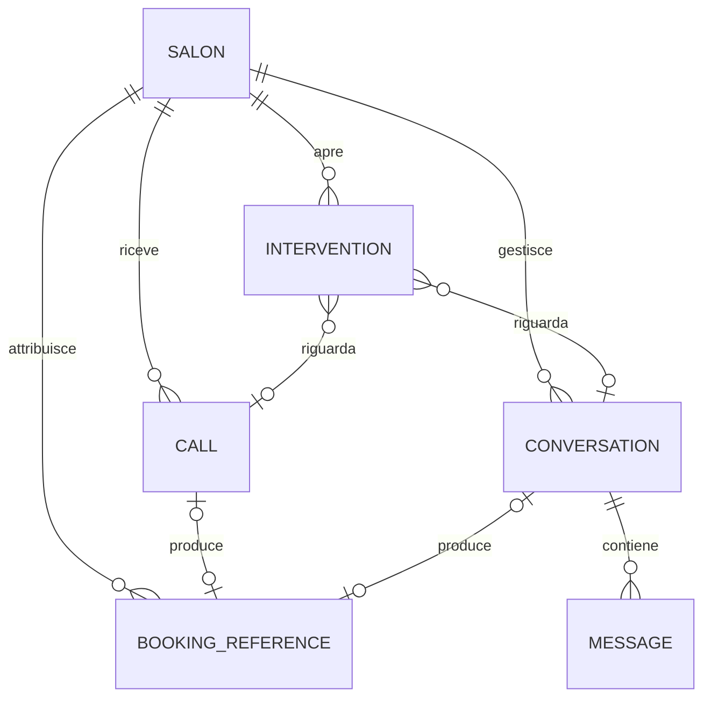

# BetterCallQ Dashboard — Modello dati

**Stato:** modello concettuale iniziale  
**Ultimo aggiornamento:** 30 luglio 2026

## 1. Scopo

Questo documento definisce il linguaggio comune tra interfaccia, service layer,
backend e integrazioni. Non rappresenta ancora uno schema SQL definitivo.

Il modello conserva configurazione e osservabilità di BetterCallQ. Non replica
l'intero calendario Treatwell.

## 2. Principi

1. Ogni entità operativa contiene `salonId`.
2. Gli identificatori interni sono indipendenti dagli identificatori dei provider.
3. Gli eventi esterni sono idempotenti.
4. Date e orari sono salvati in UTC; il salone possiede una timezone IANA.
5. Gli enum sono espliciti e validati.
6. Dati personali e contenuto delle comunicazioni hanno retention distinta.
7. Le metriche aggregate non sostituiscono gli eventi sorgente finché servono
   audit o ricalcolo.
8. Le capacità del booking provider sono dati, non assunzioni nel codice.

## 3. Relazioni principali



Altre entità, come impostazioni, integrazioni, errori, metriche e audit, sono
sempre collegate a `Salon`.

## 4. Campi condivisi

Le entità persistenti usano, salvo eccezioni:

```ts
interface EntityBase {
  id: string;
  salonId: string;
  createdAt: string;
  updatedAt: string;
}
```

- `id`: UUID interno;
- `salonId`: confine di autorizzazione;
- date: ISO 8601 in UTC;
- gli ID esterni sono memorizzati in campi dedicati, mai usati come chiave
  primaria interna.

## 5. Entità

### 5.1 Salon

Rappresenta il cliente BetterCallQ.

Campi iniziali:

```ts
interface Salon {
  id: string;
  name: string;
  timezone: string;
  locale: "it-IT";
  phoneNumber?: string;
  whatsappNumber?: string;
  address?: PostalAddress;
  status: "trial" | "active" | "suspended";
  createdAt: string;
  updatedAt: string;
}
```

Per il pilota esiste un solo salone, ma non viene codificato come costante
globale.

### 5.2 User e SalonMembership

Verranno introdotti con l'autenticazione.

```ts
interface User {
  id: string;
  email: string;
  displayName: string;
  status: "invited" | "active" | "disabled";
  createdAt: string;
  updatedAt: string;
}

interface SalonMembership {
  id: string;
  salonId: string;
  userId: string;
  role: "owner" | "manager" | "viewer" | "support";
  createdAt: string;
  updatedAt: string;
}
```

Il ruolo `support` richiederà regole specifiche e non è parte del primo
prototipo.

### 5.3 Call

Telefonata ricevuta o gestita tramite Vapi.

```ts
type CallOutcome =
  | "booking_completed"
  | "information_provided"
  | "change_or_cancellation"
  | "transferred"
  | "incomplete"
  | "technical_error"
  | "abandoned";

interface Call extends EntityBase {
  provider: "vapi";
  externalCallId: string;
  customerPhone?: string;
  customerName?: string;
  startedAt: string;
  endedAt?: string;
  durationSeconds?: number;
  outcome: CallOutcome;
  summary?: string;
  requestedService?: string;
  bookingReferenceId?: string;
  transcript?: TranscriptSegment[];
  recordingUrl?: string;
  processingStatus: "receiving" | "processed" | "failed";
}
```

Vincolo previsto:

```text
UNIQUE (salonId, provider, externalCallId)
```

`recordingUrl` è opzionale e assente per impostazione predefinita.

### 5.4 Conversation

Thread WhatsApp con un cliente.

```ts
type ConversationControl = "ai" | "human";

type ConversationStatus =
  | "ai_handled"
  | "needs_intervention"
  | "human_control"
  | "waiting_customer"
  | "completed";

interface Conversation extends EntityBase {
  provider: "whatsapp";
  externalConversationKey: string;
  customerPhone: string;
  customerName?: string;
  status: ConversationStatus;
  control: ConversationControl;
  summary?: string;
  lastMessageAt?: string;
  bookingReferenceId?: string;
}
```

Il cambio di controllo deve essere atomico per evitare risposte contemporanee
dell'IA e dell'operatore.

### 5.5 Message

Messaggio appartenente a una conversazione.

```ts
type MessageAuthor = "customer" | "ai" | "human" | "system";
type MessageDirection = "inbound" | "outbound";
type MessageStatus = "received" | "queued" | "sent" | "delivered" | "read" | "failed";

interface Message extends EntityBase {
  conversationId: string;
  externalMessageId?: string;
  author: MessageAuthor;
  direction: MessageDirection;
  body: string;
  status: MessageStatus;
  sentAt: string;
  errorCode?: string;
}
```

Vincolo previsto per messaggi Meta:

```text
UNIQUE (salonId, externalMessageId)
```

### 5.6 Intervention

Eccezione che richiede una persona.

```ts
type InterventionPriority = "low" | "medium" | "high" | "urgent";
type InterventionStatus = "open" | "in_progress" | "resolved" | "dismissed";
type InterventionSource = "call" | "whatsapp" | "booking" | "integration";

type InterventionReason =
  | "human_requested"
  | "service_not_recognized"
  | "availability_unavailable"
  | "booking_incomplete"
  | "special_request"
  | "booking_sync_failed"
  | "customer_dispute"
  | "integration_error"
  | "other";

interface Intervention extends EntityBase {
  source: InterventionSource;
  reason: InterventionReason;
  priority: InterventionPriority;
  status: InterventionStatus;
  title: string;
  summary: string;
  customerName?: string;
  customerPhone?: string;
  callId?: string;
  conversationId?: string;
  bookingReferenceId?: string;
  resolvedAt?: string;
  resolvedByUserId?: string;
  resolutionNote?: string;
}
```

Una richiesta può riferirsi a una chiamata o a una conversazione; entrambi i
riferimenti sono opzionali perché alcuni errori nascono direttamente da
un'integrazione.

### 5.7 BookingReference

Riferimento minimo a un appuntamento governato da un sistema esterno.

```ts
type BookingProviderName = "treatwell" | "google_calendar" | "manual" | "unknown";
type BookingSyncStatus = "pending" | "synced" | "failed" | "cancelled";

interface BookingReference extends EntityBase {
  provider: BookingProviderName;
  externalBookingId?: string;
  externalUrl?: string;
  syncStatus: BookingSyncStatus;
  customerName?: string;
  customerPhone?: string;
  serviceName?: string;
  operatorName?: string;
  startsAt?: string;
  endsAt?: string;
  lastSyncedAt?: string;
}
```

Questa entità serve a:

- collegare chiamata o conversazione all'esito;
- mostrare un riepilogo nella dashboard;
- diagnosticare la sincronizzazione;
- aprire l'appuntamento nel provider, quando esiste un URL.

Non è un calendario BetterCallQ completo.

### 5.8 ChannelStatus

Fotografia dello stato di un canale o integrazione.

```ts
type ChannelKind = "vapi" | "whatsapp" | "booking_provider";
type HealthStatus = "operational" | "degraded" | "offline" | "not_configured";

interface ChannelStatus extends EntityBase {
  channel: ChannelKind;
  status: HealthStatus;
  checkedAt: string;
  lastSuccessfulEventAt?: string;
  message?: string;
  capability?: BookingProviderCapabilities;
}
```

Lo stato mostrato al parrucchiere deve essere tradotto in linguaggio semplice.

### 5.9 IntegrationConnection

Metadati non segreti della configurazione di un provider.

```ts
interface IntegrationConnection extends EntityBase {
  provider: "vapi" | "whatsapp" | "treatwell" | "google_calendar";
  status: "not_configured" | "connected" | "action_required" | "disabled";
  externalAccountId?: string;
  connectedAt?: string;
  lastVerifiedAt?: string;
  capabilities?: Record<string, boolean>;
}
```

Token, password e chiavi non sono campi di questa entità: appartengono a un
secret store.

### 5.10 ReceptionistSettings

Configurazione versionata usata dall'assistente.

```ts
interface ReceptionistSettings extends EntityBase {
  version: number;
  salonProfile: SalonProfileSettings;
  openingHours: WeeklyOpeningHours;
  closures: SpecialClosure[];
  services: ServiceConfig[];
  faqs: FaqEntry[];
  policies: PolicySettings;
  escalation: EscalationSettings;
  voiceAndTone: VoiceAndToneSettings;
  bookingRules: BookingRules;
  publishedAt?: string;
  publishedByUserId?: string;
}
```

Sottostrutture principali:

```ts
interface ServiceConfig {
  id: string;
  externalServiceId?: string;
  name: string;
  aliases: string[];
  description?: string;
  durationMinutes?: number;
  priceCents?: number;
  enabled: boolean;
  operatorIds?: string[];
}

interface FaqEntry {
  id: string;
  question: string;
  answer: string;
  enabled: boolean;
  sortOrder: number;
}

interface BookingRules {
  minimumNoticeMinutes?: number;
  maximumAdvanceDays?: number;
  preparationMinutes?: number;
  allowAiCancellation: boolean;
  allowAiReschedule: boolean;
}

interface EscalationSettings {
  transferPhone?: string;
  transferDuringOpeningHoursOnly: boolean;
  reasons: InterventionReason[];
}
```

Prima della sincronizzazione dei servizi con Treatwell va definita la proprietà
di ogni campo: BetterCallQ, Treatwell o modifica manuale.

### 5.11 IntegrationError

Errore tecnico normalizzato.

```ts
interface IntegrationError extends EntityBase {
  provider: "vapi" | "whatsapp" | "treatwell" | "google_calendar" | "internal";
  operation: string;
  severity: "info" | "warning" | "error" | "critical";
  status: "open" | "retrying" | "resolved" | "ignored";
  publicMessage: string;
  technicalCode?: string;
  correlationId?: string;
  externalEventId?: string;
  attemptCount: number;
  lastAttemptAt?: string;
  resolvedAt?: string;
}
```

Il dettaglio tecnico non deve esporre dati personali o segreti nell'interfaccia.

### 5.12 DailyMetric

Aggregato giornaliero per dashboard e controllo costi.

```ts
interface DailyMetric extends EntityBase {
  date: string;
  callsReceived: number;
  callsCompleted: number;
  callDurationSeconds: number;
  whatsappConversations: number;
  whatsappMessagesInbound: number;
  whatsappMessagesOutbound: number;
  bookingsAttributed: number;
  interventionsCreated: number;
  interventionsResolved: number;
  integrationErrors: number;
  estimatedCostCents: number;
}
```

Il campo `date` rappresenta il giorno nella timezone del salone.

### 5.13 ExternalEvent

Registro tecnico minimo per deduplicare webhook e diagnosticare elaborazioni.

```ts
interface ExternalEvent extends EntityBase {
  provider: "vapi" | "whatsapp" | "booking_provider";
  externalEventId: string;
  eventType: string;
  receivedAt: string;
  processedAt?: string;
  status: "received" | "processed" | "failed" | "ignored";
  correlationId: string;
  payloadRetentionUntil?: string;
}
```

Vincolo previsto:

```text
UNIQUE (salonId, provider, externalEventId)
```

Il payload grezzo può avere retention più breve del record tecnico.

### 5.14 AuditEvent

Traccia le modifiche rilevanti effettuate dagli utenti.

```ts
interface AuditEvent extends EntityBase {
  actorUserId?: string;
  action: string;
  entityType: string;
  entityId?: string;
  summary: string;
  correlationId?: string;
}
```

Non deve conservare password, token o copie complete non necessarie dei dati
personali modificati.

## 6. Enum e transizioni

### 6.1 Controllo e stato della conversazione

Il campo `control` ammette soltanto:

```text
ai → human
human → ai
```

Il cambio deve essere atomico. Il campo `status` descrive invece il ciclo
operativo:

```text
ai_handled → needs_intervention → human_control
human_control → waiting_customer
waiting_customer → human_control
human_control → ai_handled
ai_handled → completed
human_control → completed
```

`needs_intervention` descrive la presenza nella coda; `control` stabilisce chi è
autorizzato a inviare la prossima risposta.

### 6.2 Intervento

```text
open → in_progress → resolved
open → dismissed
in_progress → open
```

`resolved` e `dismissed` richiedono timestamp e attore, quando disponibile.

### 6.3 Sincronizzazione appuntamento

```text
pending → synced
pending → failed
failed → pending
synced → cancelled
```

## 7. Indici e vincoli previsti

Lo schema SQL futuro dovrebbe almeno prevedere:

- unicità degli ID esterni per salone e provider;
- indice su `Call(salonId, startedAt)`;
- indice su `Conversation(salonId, lastMessageAt)`;
- indice su `Intervention(salonId, status, priority, createdAt)`;
- indice su `Message(conversationId, sentAt)`;
- indice su `IntegrationError(salonId, status, createdAt)`;
- unicità di `DailyMetric(salonId, date)`;
- integrità dei riferimenti sempre entro lo stesso `salonId`.

## 8. Dati derivati

Non è necessario persistere ogni valore mostrato dalla UI.

Esempi derivabili:

- tasso di completamento;
- durata media;
- variazione rispetto al periodo precedente;
- numero richieste ancora aperte;
- costo progressivo del mese.

Le formule devono essere centralizzate nel service layer o nel backend, non
duplicate nei componenti.

## 9. Retention da definire

| Dato | Impostazione iniziale proposta | Decisione richiesta |
|---|---|---|
| Audio | Non conservato | Confermare prima del pilota |
| Trascrizioni | Breve e configurabile | Definire durata |
| Messaggi WhatsApp | Limitata alle necessità operative | Definire durata |
| Eventi grezzi webhook | Breve, dopo elaborazione | Definire durata |
| Metadati chiamate | Più lunga per metriche e audit | Definire durata |
| Metriche aggregate | Lunga, senza contenuti sensibili | Confermare |
| Audit | Secondo necessità legali e operative | Definire durata |

## 10. Fixture del prototipo

Le fixture devono:

- essere chiaramente fittizie;
- usare numeri di telefono non reali;
- coprire stati riusciti, vuoti, degradati ed errore;
- contenere almeno una chiamata per ogni esito;
- contenere conversazioni in controllo IA e umano;
- contenere interventi con priorità diverse;
- essere accessibili soltanto attraverso un service mock.

Struttura prevista:

```text
lib/
├── domain/
│   ├── schemas/
│   └── types/
├── services/
│   ├── dashboard-service.ts
│   └── mock-dashboard-service.ts
└── fixtures/
    └── pilot-salon/
```

## 11. Validazione

Per ogni contratto TypeScript deve esistere uno schema Zod corrispondente o
derivato. I dati provenienti da:

- form;
- API;
- webhook;
- variabili di ambiente non segrete;
- fixture;

vengono validati ai confini del sistema.

## 12. Questioni aperte

- operatori e agende separate nel salone pilota;
- campi realmente disponibili da Treatwell;
- proprietà e sincronizzazione di servizi, prezzi e durate;
- retention;
- ruoli utente;
- dettagli necessari per attribuire una prenotazione a BetterCallQ;
- formula definitiva dei costi;
- necessità di conservare lo storico delle versioni delle impostazioni.
