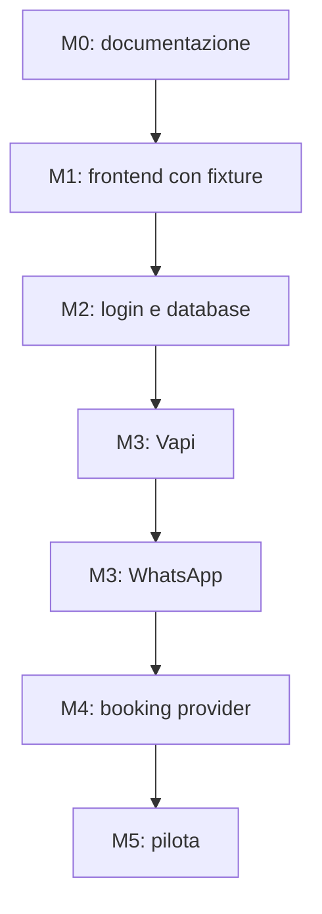

# BetterCallQ Dashboard — Roadmap

**Stato:** piano operativo iniziale  
**Ultimo aggiornamento:** 30 luglio 2026

## 1. Strategia

Il progetto procede per attività piccole e verificabili. Ogni attività:

1. modifica una sola area coerente;
2. riutilizza i contratti esistenti;
3. aggiunge loading, empty ed error state;
4. esegue lint, test pertinenti e build;
5. termina con un commit descrittivo;
6. documenta problemi e decisioni rimaste.

La prima milestone è una dashboard completa e navigabile con fixture. Soltanto
dopo vengono aggiunti autenticazione, database e un'integrazione reale alla
volta.

## 2. Milestone

| Milestone | Risultato |
|---|---|
| M0 — Fondamenta | Specifiche e decisioni condivise |
| M1 — Prototipo frontend | Tutte le sezioni navigabili con fixture |
| M2 — Applicazione persistente | Login, autorizzazioni e database |
| M3 — Canali reali | Vapi e WhatsApp collegati |
| M4 — Appuntamenti | Booking provider verificato e integrato |
| M5 — Pilota | Sicurezza, test, monitoraggio e deploy |

## 3. Ordine delle attività

### Task 1 — Documentazione fondativa

**Stato:** completata

Creare:

- `docs/PRODUCT_SPEC.md`;
- `docs/ARCHITECTURE.md`;
- `docs/DATA_MODEL.md`;
- `docs/ROADMAP.md`.

Uscita:

- scopo e non-obiettivi espliciti;
- sette sezioni della dashboard definite;
- confini tra Vapi, WhatsApp, Treatwell e BetterCallQ;
- gate Treatwell visibile;
- nessun codice applicativo.

### Task 2 — Scaffold tecnico

**Stato:** completata

Inizializzare:

- Next.js App Router;
- TypeScript strict;
- Tailwind;
- shadcn/ui e Radix;
- Zod;
- Recharts;
- Framer Motion;
- Lucide;
- script lint e build;
- `.gitignore` e `.env.example` privi di valori reali.

Non installare Gemini, Vercel AI SDK o meccanismi di dashboard generativa.

Uscita:

- pagina minimale avviabile;
- lint e build verdi;
- nessuna sezione operativa ancora implementata.

### Task 3 — Contratti, schemi e fixture

**Stato:** completata

Implementare:

- tipi TypeScript;
- schemi Zod;
- enum;
- fixture del salone pilota;
- interfaccia `DashboardService`;
- implementazione mock;
- test essenziali di validazione.

Uscita:

- nessuna pagina importa direttamente array mock;
- fixture chiaramente fittizie;
- tutti i dati operativi contengono `salonId`.

### Task 4 — Design system e app shell

**Stato:** completata

Implementare:

- palette e token semantici;
- tema chiaro/scuro;
- sidebar desktop;
- drawer mobile;
- header con salone e stato;
- route delle sette sezioni;
- componenti condivisi per loading, empty ed error state.

Uscita:

- navigazione completa;
- contenuti delle pagine ancora minimali;
- verifica a 360 px, tablet e desktop.

### Task 5 — Panoramica

**Stato:** completata

Implementare una griglia responsive a 12 colonne con:

- quattro KPI;
- stato canali;
- coda urgente;
- andamento chiamate e prenotazioni;
- attività recenti;
- riepilogo errori;
- `DashboardWidgetRenderer` tipizzato.

Uscita:

- tutti i dati arrivano dal service mock;
- filtri temporali realmente collegati al service;
- grafici leggibili anche su mobile.

### Task 6A — Da gestire

**Stato:** completata

Implementare:

- coda;
- priorità;
- filtri;
- dettaglio;
- azioni simulate;
- risoluzione e riapertura simulate.

Uscita:

- aggiornamento coerente della coda e dei KPI mock;
- conferma prima delle azioni irreversibili simulate.

### Task 6B — Chiamate

**Stato:** completata

Implementare:

- elenco e paginazione;
- filtri per esito e data;
- riepilogo;
- collegamento all'intervento;
- trascrizione espandibile;
- riferimento appuntamento.

Uscita:

- stati di chiamata completi;
- nessuna registrazione audio richiesta dal prototipo.

### Task 6C — WhatsApp

**Stato:** completata

Implementare:

- inbox a due pannelli;
- lista conversazioni;
- cronologia messaggi;
- presa e rilascio del controllo;
- invio manuale simulato;
- stati della conversazione.

Uscita:

- nessuna chiamata Meta reale;
- prevenzione simulata delle risposte IA durante il controllo umano;
- esperienza mobile verificata.

### Task 7A — Impostazioni IA

**Stato:** completata

Implementare moduli per:

- profilo salone;
- servizi;
- orari e chiusure;
- FAQ;
- politiche;
- tono;
- regole di prenotazione;
- escalation e trasferimento.

Uscita:

- validazione Zod;
- modifiche salvate nel service mock;
- gestione modifiche non salvate;
- nessun prompt Vapi aggiornato automaticamente.

### Task 7B — QR e canali

**Stato:** completata

Implementare:

- numeri e stati;
- link `wa.me`;
- messaggio precompilato;
- QR;
- download PNG e SVG;
- test locale del link.

Uscita:

- nessun token Meta richiesto;
- QR generato esclusivamente dal numero e dal testo configurati.

### Task 7C — Monitoraggio

**Stato:** completata

Implementare:

- volumi;
- durata media;
- tasso di completamento;
- interventi;
- errori;
- stima costi;
- confronto tra periodi.

Uscita:

- formule centralizzate;
- unità e periodo sempre visibili;
- nessun dato inventato fuori dalle fixture.

**Milestone M1:** completata. Tutte le sezioni frontend sono navigabili e
alimentate tramite fixture isolate dal service layer.

### Gate T — Verifica Treatwell

Questa ricerca può avvenire mentre si costruisce il frontend, ma blocca
l'integrazione appuntamenti.

Verificare per il salone pilota:

- API, credenziali o programma partner;
- lettura disponibilità;
- creazione appuntamento;
- modifica;
- cancellazione;
- webhook;
- limiti, costi e condizioni contrattuali;
- collegamento tra servizi e operatori;
- URL diretto dell'appuntamento.

Uscita:

- matrice delle capacità confermate;
- evidenze e contatto Treatwell, se necessario;
- decisione sul fallback;
- nessuna automazione browser non autorizzata.

### Task 8 — Autenticazione e database

Implementare:

- provider di autenticazione;
- sessioni;
- `Salon`, `User` e `SalonMembership`;
- database e migrazioni;
- isolamento per `salonId`;
- repository reali;
- protezione delle route;
- audit minimo;
- migrazione delle fixture dietro flag di sviluppo.

Uscita:

- un utente non può accedere a un altro salone;
- dati persistenti;
- segreti fuori dal repository;
- test di autorizzazione.

### Task 9 — Integrazione Vapi

Implementare:

1. ricezione webhook;
2. verifica autenticità;
3. idempotenza;
4. persistenza chiamate;
5. report finale, riepilogo e trascrizione;
6. collegamento booking;
7. creazione interventi;
8. aggiornamento dashboard.

Uscita:

- eventi duplicati innocui;
- errori recuperabili;
- retention applicata;
- dashboard alimentata da chiamate reali.

### Task 10 — Integrazione WhatsApp

Dividere in sotto-task:

1. verifica webhook Meta;
2. ricezione e deduplicazione;
3. persistenza conversazioni e messaggi;
4. invio;
5. controllo IA/umano atomico;
6. stati di consegna;
7. errori e retry;
8. aggiornamento inbox.

Uscita:

- conversazione bidirezionale reale;
- nessuna doppia risposta;
- presa in carico verificata end-to-end.

### Task 11 — Booking provider

Implementare soltanto dopo Gate T:

- interfaccia `BookingProvider`;
- matrice capacità;
- adapter scelto;
- disponibilità;
- creazione, modifica e cancellazione soltanto se supportate;
- `BookingReference`;
- errori di sincronizzazione;
- intervento automatico in caso di fallimento.

Uscita:

- nessuna operazione promessa oltre le capacità reali;
- Treatwell resta l'agenda ordinaria;
- assenza di doppie prenotazioni dovute a retry.

### Task 12 — Realtime, sicurezza e deploy pilota

Completare:

- aggiornamenti automatici;
- rate limiting;
- retry e dead-letter;
- retention;
- cancellazione/esportazione dati;
- log privi di dati sensibili;
- test end-to-end;
- monitoraggio errori;
- backup;
- deploy;
- dominio;
- procedura di rollback;
- checklist operativa del salone.

Uscita:

- flussi critici verificati;
- allarmi tecnici;
- ripristino documentato;
- accesso limitato al salone pilota.

## 4. Dipendenze



Il Gate T può procedere in parallelo a M1 e M2, ma deve chiudersi prima di M4.

## 5. Definition of done per task

Una task è conclusa quando:

- l'ambito richiesto è completo;
- non contiene modifiche estranee;
- i componenti esistenti sono stati riutilizzati;
- loading, empty ed error state sono presenti dove pertinenti;
- non sono stati aggiunti segreti;
- lint è verde;
- test pertinenti sono verdi;
- build è verde;
- file modificati e limiti residui sono riportati;
- documentazione e contratti sono aggiornati se il comportamento cambia.

Per la sola Task 1, non esistendo ancora l'applicazione, la verifica consiste in
coerenza dei documenti, collegamenti interni e assenza di dati sensibili.

## 6. Disciplina dei prompt

Ogni prompt di implementazione deve terminare con:

```text
Lavora soltanto sulla funzione richiesta.
Non modificare le integrazioni o le pagine non coinvolte.
Riutilizza i componenti esistenti.
Non inserire segreti nel repository.
Aggiungi loading, empty ed error state.
Esegui lint, test pertinenti e build.
Riporta i file modificati e gli eventuali problemi rimasti.
```

Non usare un unico mega-prompt per più pagine operative o integrazioni.

## 7. Rischi principali

| Rischio | Mitigazione |
|---|---|
| Treatwell non offre le API necessarie | Gate anticipato e `BookingProvider` astratto |
| Doppie risposte IA/umano | Stato di controllo atomico |
| Webhook duplicati | ID esterni univoci e idempotenza |
| Due agende divergenti | Nessun calendario BetterCallQ completo |
| UI costruita su dati inventati | Fixture isolate dietro service layer |
| Segreti pubblicati | `.env` escluso, secret store e review |
| Costi superiori alle stime | Metriche d'uso e costo per provider |
| Dati personali conservati troppo a lungo | Retention esplicita prima del pilota |
| Smartphone trascurato | Verifica responsive a ogni pagina |

## 8. Funzioni successive al pilota

Non entrano nell'MVP:

- statistiche avanzate;
- confronto tra saloni;
- campagne;
- programmi fedeltà;
- pagamenti;
- console amministrativa BetterCallQ;
- suggerimenti IA sui problemi ricorrenti;
- generazione di report periodici;
- gestione autonoma di più sedi.

### Task 8A — Fondazione ruoli e permessi

**Stato:** completata

Implementare:

- ruoli `admin` e `salon_owner`;
- catalogo e matrice centralizzata dei permessi;
- navigazione distinta per amministratore e proprietario;
- route iniziale “Dati del salone”;
- test dei contratti RBAC;
- modello dati previsto per profili, membership e audit.

Uscita:

- l'interfaccia attuale resta in modalità admin fino alla Task 8B;
- il proprietario dispone di quattro sole sezioni;
- nessun controllo UI viene considerato sicurezza;
- login, sessioni e autorizzazione server-side restano nelle Task 8B e 8C.

### Task 8B — Autenticazione e sessione

**Stato:** completata

Implementare:

- Supabase Auth con email e password;
- sessione SSR in cookie tramite `@supabase/ssr`;
- rinnovo sessione nel `proxy.ts` di Next.js 16;
- route pubblica `/accedi`;
- callback PKCE;
- logout;
- risoluzione di ruolo e salone da `app_metadata`;
- shell e navigazione alimentate dalla sessione;
- blocco degli account autenticati ma non configurati.

Uscita:

- nessuna dashboard privata senza sessione;
- nessuna registrazione pubblica;
- nessun ruolo letto da `user_metadata`;
- nessuna chiave `service_role` nel frontend;
- persistenza applicativa e RLS rinviate alla Task 8C.
